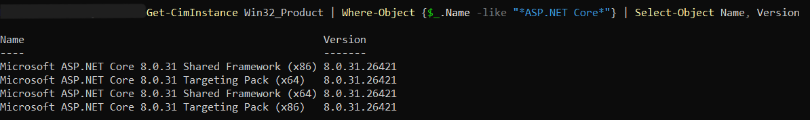

# Finding: CVE-2025-26682 - ASP.NET Core and Visual Studio Denial of Service Vulnerability

**ID:** F-001 
**Severity:** High 
**Status:** Remediated 
**Affected System:** Windows
**Affected Component:** Microsoft ASP.NET Core 8.0.14 Shared Framework (x86)  
**CVE:** CVE-2025-26682  

---

## 1. Description

CVE-2025-26682 is a denial-of-service vulnerability affecting certain versions of ASP.NET Core.

During the vulnerability assessment, Wazuh identified **Microsoft ASP.NET Core 8.0.14 Shared Framework (x86)** as vulnerable on the Windows endpoint.

The installed version was within the affected version range for CVE-2025-26682.

---

## 2. Risk

The vulnerability can potentially be exploited remotely by an unauthenticated attacker and may result in a denial of service.

The primary security impact is **availability**. The vulnerability does not directly affect the confidentiality or integrity of data according to the CVSS assessment.

---

## 3. Detection

The vulnerability was identified using the **Wazuh vulnerability detection functionality**.

The Wazuh dashboard listed CVE-2025-26682 as a vulnerability affecting the Windows endpoint. The vulnerability details were then investigated to determine the affected software and installed version.

### Tools Used

- Wazuh
- Kali Linux
- Windows PowerShell

### Detection Process

1. Wazuh identified CVE-2025-26682 on the Windows endpoint.
2. The affected software was identified as Microsoft ASP.NET Core 8.0.14 Shared Framework (x86).
3. The installed ASP.NET Core version was manually verified on the Windows machine.
4. The installed version was compared against the affected versions documented for CVE-2025-26682.

---

## 4. Evidence

### Wazuh Detection

The Wazuh dashboard identified CVE-2025-26682 as a high-severity vulnerability on the Windows endpoint.


### Installed Version

The installed ASP.NET Core versions were verified using PowerShell:

```powershell
Get-ChildItem "C:\Program Files (x86)\dotnet\shared\Microsoft.AspNetCore.App"
```

The output showed taht version **8.0.14** was installed.


## Observation
The isntalled **ASP.NET Core 8.0.14** version was identified as the vulnerable version reported by Wazuh for CVE-2025-26682, confirming the vulnerability was present on Windows endpoint.

---

## 5. Remediation

The affected ASP.NET Core installation was updated to a newer version.

Version **8.0.31** was installed on the Windows endpoint.

The previous vulnerable version was subsequently removed from the system to prevent the vulnerable version from remaining installed.

---

## 6. Verification

After remediation, the installed ASP.NET Core versions were checked again using PowerShell:
```powershell
Get-ChildItem "C:\Program Files (x86)\dotnet\shared\Microsoft.AspNetCore.App"
```

The vulnerable **8.0.14** version was no longer present and version **8.0.31** was installed.


The Wazuh dashboard was then refreshed and CVE-2025-26682 was no longer reported for the Windows endpoint.

---

## 7. Result

**Status:** Remediated

CVE-2025-26682 was successfully remediated by updating the affected ASP.NET Core installation and removing the vulnerable version.

The endpoint was subsequently rechecked and the vulnerability was no longer reported by Wazuh.

---

## 8. Lessons Learned

This finding demonstrated the importance of monitoring installed software versions and using vulnerability detection to identify outdated components.

The remediation process also demonstrated the importance of verifying security fixes after they have been applied. In this case, both the installed software version and the Wazuh vulnerability status were checked after remediation.

