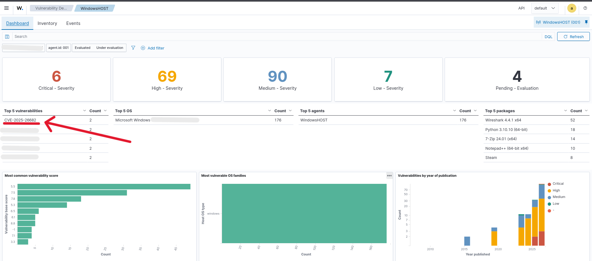

# Finding: CVE-2025-26682 - ASP.NET Core and Visual Studio Denial of Service Vulnerability

**ID:** F-001
**Severity:** High
**Status:** Remediated
**Affected System:** Windows

---

## 1. Description

Microsoft describes CVE-2025-26682 as an allocation-of-resources vulnerability in ASP.NET Core for versions including 8.0.14 and earlier. On yhe windows Machine the package Microsoft ASP.NET  Core 8.0.14  Shared Frameword (x86) was affected.

---

## 2. Risk

An unauthenticated attacker can exploit the issue remotely over a network, potentially causing a denial of service. The vulnerability affects availability, rather than confidentiality or integrity.

---

## 3. Detection

Explain how the issue was identified.

**Tools used:**

* Wazuh
* Kali Linux
* Nmap
* Windows configuration / logs

**Detection method:**

On Wazuh dahsboard it was listed as top vulnerability. Upon investigation further details are noticed.

---

## 4. Evidence

### Before Remediation

**Observation:**

Running the command 'Get-Children "C:\Progran Files (x86)\dotnet\shared\Microsoft.AspNetCore.App"' you can see that currently the vulnerable 8.0.14 is installed
---

## 5. Remediation

For remediation, an updated version had to be installed. version 8.0.31 was installed. Also had to delete the previous version.

---

## 6. Verification

After refreshing the Wazuh dashboard, the high risk vulnerability disappeared.

### After Remediation

---

## 7. Result

**Status:** Remediated

The vulnerability was successfully addressed and the original condition could no longer be reproduced.

---

## 8. Lessons Learned

Briefly document what you learned from the finding.

Example:

> This finding demonstrated the importance of identifying unnecessary services and verifying that security changes are effective through a second test.

